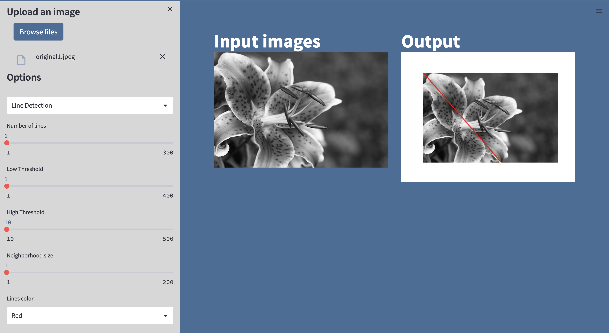
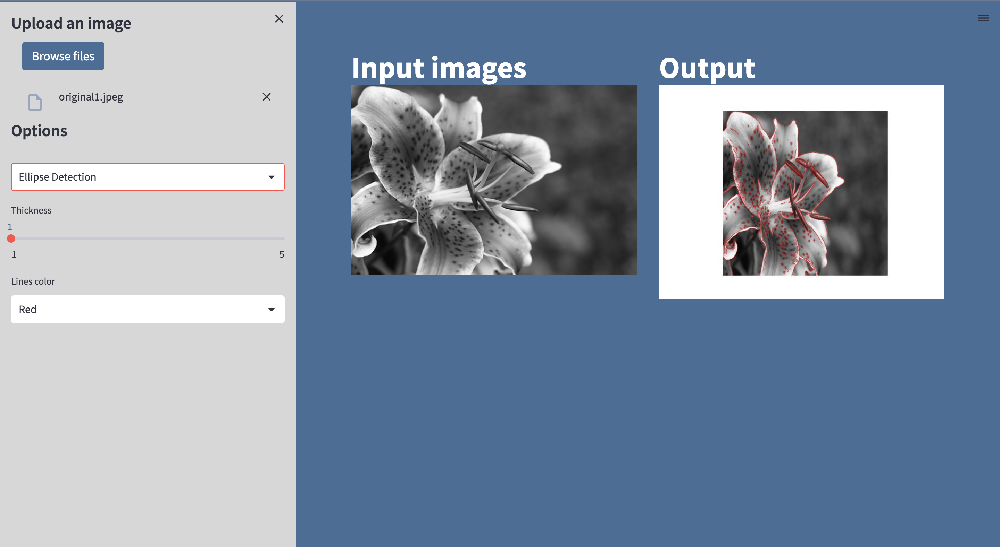
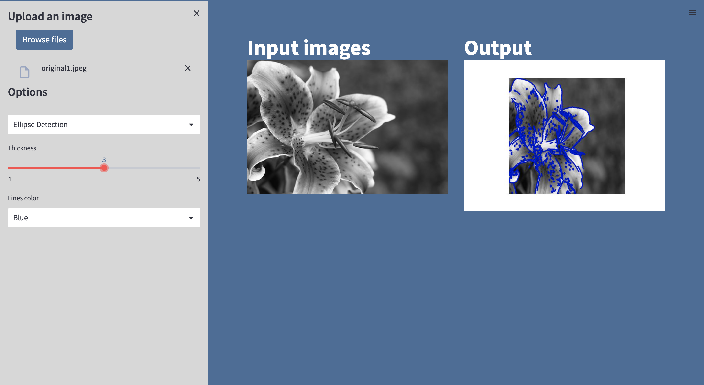

# Filtering and edge detection

A web application that use python script for image processing such as detect edges using canny detection , Detect lines , Detect circles , Detect ellipse and initialize the contour and evolve the Active Contour Model (snake) using the greedy algorithm.

> ## Table of Contents

- [Built with](#Built-with)
- [Deployment](#Deployment)
- [Design](#Design)
- [Features](#Features)
- [Authors](#Authors)


> ## Built with


> ## Deployment

 Install streamlit

```bash
  pip install streamlit
```

To start deployment 
```bash
  streamlit run app.py
```

> ## 🖌️ Design


> ## Features
###  Detect edges using Canny detection


#### Detect objects using Hough transform
1. Detect lines
- Default parameter


- Effect of Low threshold and High threshold parameter


- Effect of Neighboorhood size parameter


2. Detect ellipse
- Default parameter


- Effect of Thickness parameter


3. Detect circles


###  Apply Active Contour (Snake)


> ## 🔗 Authors
- Esraa Ali         
sec : 1   BN : 12

- Rawan Abdulhamid  
sec : 1   BN : 33

- Mostafa Mahmoud   
sec : 2   BN : 37

- Omar Mustafa      
sec : 2   BN : 5  

- Yehia Said        
sec : 2   BN : 53 


All rights reserved © 2023 to Team 9 - Systems & Biomedical Engineering, Cairo University (Class 2024)